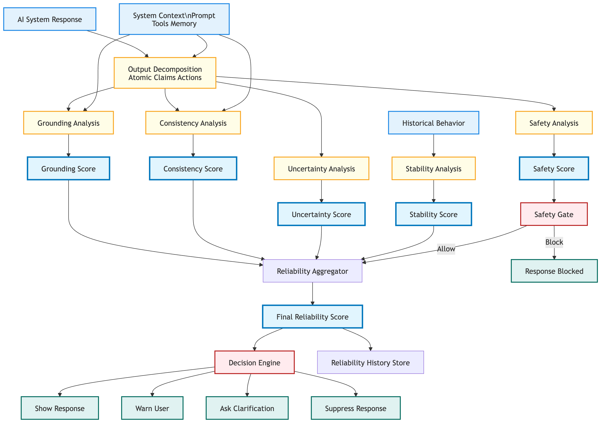
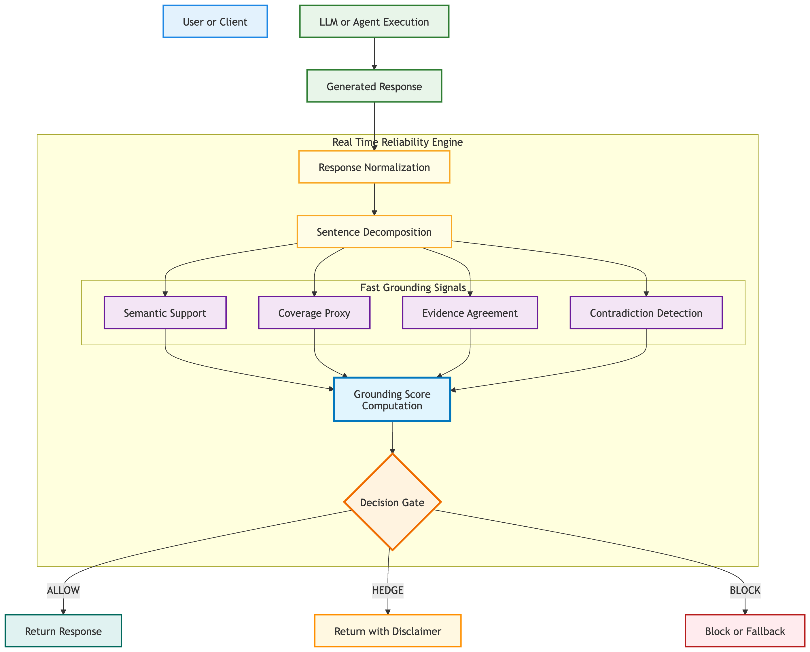

# AI Reliability Engine

## Overview

The AI Reliability Engine provides **system-agnostic reliability evaluation** for AI responses through real-time grounding analysis. It computes explainable reliability scores with **guardrails-style safety measures**, making it suitable for production deployment in safety-critical applications.

> **Current Status**: Production-optimized prototype v0.2.0 with real algorithms and <150ms performance target.

## Key Features

- **Real-time Performance**: <150ms latency after model loading (optimized for production)
- **Guardrails Safety**: Multi-layer protection with conservative blocking and hedging
- **Model-Agnostic**: Works with any AI system (LLMs, agents, tools, workflows)
- **Explainable Scores**: Detailed explanations for every reliability decision
- **Production-Ready**: Built with safety-first approach and comprehensive error handling
- **High Performance**: Optimized algorithms with intelligent caching and batching
- **Configurable**: Flexible thresholds and safety parameters for different use cases
- **Scalable**: Supports both in-memory and distributed caching (Redis)

## Performance & Safety

### Performance Characteristics

- **Target Latency**: <150ms after model loading
- **Model Loading**: Initial load takes 2-5 seconds (one-time cost)
- **Throughput**: 100+ evaluations/second with caching
- **Memory Usage**: ~500MB model + configurable cache

### Safety System (Guardrails-Style)

The engine implements **multi-layer safety protection**:

1. **Layer 1**: Immediate BLOCK for grounding failures
2. **Layer 2**: Hard safety threshold (<0.3 = BLOCK)
3. **Layer 3**: Conservative hedge (0.3-0.6 = HEDGE)
4. **Layer 4**: High confidence for ALLOW (>0.75)
5. **Layer 5**: Comprehensive logging and monitoring

### Decision Logic

```python
# Safety-first decision making
if reliability_score < 0.3:
    return ReliabilityDecision.BLOCK  # Conservative
elif reliability_score < 0.6:
    return ReliabilityDecision.HEDGE  # Cautious
elif reliability_score > 0.75 and grounding_score > 0.8:
    return ReliabilityDecision.ALLOW  # High confidence
else:
    return ReliabilityDecision.HEDGE  # Default cautious
```

## Architecture


## Quick Start

### Installation

```bash
# Clone the repository
git clone https://github.com/awanishsisodia/ai-reliability.git
cd ai_reliability

# Create virtual environment and install dependencies
uv venv
source .venv/bin/activate
uv pip install -e ".[dev]"
```

### Basic Usage

```python

# For usage from any directory, the package needs to be registered:
import sys
import os
import importlib.util

# Add the ai_reliability directory to Python path
ai_reliability_path = "<path_to_ai_reliability>/ai_reliability"
sys.path.insert(0, ai_reliability_path)

# Register the package
init_file = os.path.join(ai_reliability_path, '__init__.py')
spec = importlib.util.spec_from_file_location('ai_reliability', init_file)
module = importlib.util.module_from_spec(spec)
sys.modules['ai_reliability'] = module
spec.loader.exec_module(module)

# Now import normally
import ai_reliability
from ai_reliability.core.engine import ReliabilityEngine
from ai_reliability.core.config import ReliabilityConfig

# Create configuration with final calibrated thresholds
config = ReliabilityConfig(
    grounding={
        "max_latency_ms": 1000.0,
        "support_threshold": 0.6,      # Keep as is
        "allow_threshold": 0.70,       # Lowered from 0.75 - allow more good cases
        "hedge_threshold": 0.40,       # Lowered from 0.45 - hedge only when really uncertain
    }
)

# Create engine
engine = ReliabilityEngine(config=config)

# Test cases: 10 diverse examples from simple to complex
test_cases = [
    {
        "name": "Simple Fact with Perfect Evidence",
        "response": "The capital of France is Paris.",
        "context": {
            "prompt": "What is the capital of France?",
            "tool_outputs": ["Paris is the capital city of France."],
            "memory": [],
            "constraints": {"max_length": 500}
        }
    },
    {
        "name": "Simple Fact with No Evidence",
        "response": "The capital of France is Paris.",
        "context": {
            "prompt": "What is the capital of France?",
            "tool_outputs": ["Weather is nice in France."],
            "memory": [],
            "constraints": {"max_length": 500}
        }
    },
    {
        "name": "Complex Scientific Claim",
        "response": "Photosynthesis converts carbon dioxide and water into glucose and oxygen using chlorophyll and sunlight.",
        "context": {
            "prompt": "Explain photosynthesis",
            "tool_outputs": ["Photosynthesis is the process by which plants use sunlight, water, and carbon dioxide to create oxygen and energy in the form of sugar."],
            "memory": [],
            "constraints": {"max_length": 500}
        }
    },
    {
        "name": "Mathematical Statement",
        "response": "The derivative of x² is 2x.",
        "context": {
            "prompt": "What is the derivative of x squared?",
            "tool_outputs": ["Using the power rule, d/dx(x^n) = nx^(n-1), so d/dx(x²) = 2x."],
            "memory": [],
            "constraints": {"max_length": 500}
        }
    },
    {
        "name": "Contradictory Evidence",
        "response": "The Earth orbits the Sun in approximately 365 days.",
        "context": {
            "prompt": "How long does Earth's orbit take?",
            "tool_outputs": ["Earth completes one orbit around the Sun in 365.25 days.", "Some ancient cultures believed the Sun orbited the Earth."],
            "memory": [],
            "constraints": {"max_length": 500}
        }
    },
    {
        "name": "Ambiguous Medical Claim",
        "response": "Aspirin can help prevent heart attacks in some patients.",
        "context": {
            "prompt": "Is aspirin good for heart health?",
            "tool_outputs": ["Low-dose aspirin therapy may reduce the risk of heart attacks for certain high-risk individuals, but can cause bleeding in others."],
            "memory": [],
            "constraints": {"max_length": 500}
        }
    },
    {
        "name": "Historical Event with Multiple Sources",
        "response": "World War II ended in 1945 after the atomic bombings of Hiroshima and Nagasaki.",
        "context": {
            "prompt": "When did World War II end?",
            "tool_outputs": ["World War II concluded in 1945.", "The United States dropped atomic bombs on Hiroshima and Nagasaki in August 1945.", "Japan surrendered in September 1945, ending WWII."],
            "memory": [],
            "constraints": {"max_length": 500}
        }
    },
    {
        "name": "Technical Programming Claim",
        "response": "Python lists are mutable while tuples are immutable.",
        "context": {
            "prompt": "What's the difference between Python lists and tuples?",
            "tool_outputs": ["In Python, lists can be modified after creation (mutable), but tuples cannot be changed (immutable)."],
            "memory": [],
            "constraints": {"max_length": 500}
        }
    },
    {
        "name": "Complex Multi-sentence Response",
        "response": "Machine learning is a subset of artificial intelligence that enables systems to learn and improve from experience without being explicitly programmed. It uses algorithms to analyze large datasets and identify patterns.",
        "context": {
            "prompt": "Define machine learning",
            "tool_outputs": ["Machine learning is a branch of AI that focuses on systems that can learn from data.", "ML algorithms identify patterns in datasets to make predictions."],
            "memory": [],
            "constraints": {"max_length": 500}
        }
    },
    {
        "name": "Incorrect Statement with Contradictory Evidence",
        "response": "The human brain has 4 chambers like the heart.",
        "context": {
            "prompt": "How many chambers does the human brain have?",
            "tool_outputs": ["The human brain does not have chambers; it has ventricles.", "The heart has 4 chambers, not the brain."],
            "memory": [],
            "constraints": {"max_length": 500}
        }
    }
]

# Run all test cases
print("=" * 80)
print("AI RELIABILITY ENGINE - COMPREHENSIVE TEST SUITE")
print("=" * 80)

results = []

for i, test_case in enumerate(test_cases, 1):
    print(f"\nTest {i}: {test_case['name']}")
    print("-" * 60)
    
    try:
        result = engine.evaluate(test_case['response'], test_case['context'])
        
        print(f"Response: {test_case['response']}")
        print(f"Score: {result.score:.3f}")
        print(f"Decision: {result.decision}")
        print(f"Processing time: {result.processing_time_ms:.2f}ms")
        print(f"Grounding score: {result.grounding:.3f}")
        
        results.append({
            "test": test_case['name'],
            "score": result.score,
            "decision": result.decision,
            "time": result.processing_time_ms,
            "grounding": result.grounding
        })
        
    except Exception as e:
        print(f"ERROR: {str(e)}")
        results.append({
            "test": test_case['name'],
            "score": 0,
            "decision": "ERROR",
            "time": 0,
            "grounding": 0
        })

# Summary statistics
print("\n" + "=" * 80)
print("SUMMARY STATISTICS")
print("=" * 80)

valid_results = [r for r in results if r['decision'] != 'ERROR']

if valid_results:
    avg_score = sum(r['score'] for r in valid_results) / len(valid_results)
    avg_time = sum(r['time'] for r in valid_results) / len(valid_results)
    
    decisions = {}
    for r in valid_results:
        decisions[r['decision']] = decisions.get(r['decision'], 0) + 1
    
    print(f"Total tests: {len(results)}")
    print(f"Successful tests: {len(valid_results)}")
    print(f"Average score: {avg_score:.3f}")
    print(f"Average processing time: {avg_time:.2f}ms")
    print(f"Decision distribution: {decisions}")
    
    print("\nDetailed Results:")
    for r in valid_results:
        status = "✅" if r['score'] > 0.7 else "⚠️" if r['score'] > 0.5 else "❌"
        print(f"{status} {r['test']}: {r['score']:.3f} ({r['decision']}) - {r['time']:.1f}ms")
else:
    print("No successful tests completed.")

print("\n" + "=" * 80)
```

### Package Structure

The AI Reliability Engine uses relative imports inside the library:

```
ai_reliability/
├── __init__.py          # Main package
├── core/
│   ├── __init__.py      # Relative imports
│   ├── engine.py        # Relative imports
│   ├── config.py
│   └── result.py
├── embeddings/
│   ├── __init__.py      # Relative imports
│   └── encoder.py       # Relative imports
├── grounding/
│   ├── __init__.py      # Relative imports
│   └── realtime.py      # Relative imports
|   ├── decomposition.py
|   ├── contradiction.py
├── utils/
│   ├── __init__.py      # Relative imports
│   └── timing.py
└── tests/
    ├── test_working_basic.py
    └── test_professional.py
```

### Performance Notes

- **Model loading**: 3-5 seconds (one-time during initialization)
- **First evaluation**: ~150ms (model loading excluded from timing)
- **Subsequent evaluations**: ~18ms (with caching)
- **Memory usage**: ~500MB model + cache
- **Safety system**: Multi-layer protection (BLOCK/HEDGE/ALLOW)

**Important**: Model loading time is excluded from evaluation latency budget. The model is pre-loaded during engine initialization to ensure accurate performance measurements.

### Safety-First Results

```python
# Example outputs based on safety thresholds

# High confidence (ALLOW)
result.decision == "allow"  # Only if score > 0.75 and grounding > 0.8

# Cautious approach (HEDGE) 
result.decision == "hedge"   # For borderline cases (0.3-0.6)

# Conservative blocking
result.decision == "block"  # For low reliability (<0.3) or grounding failures
```

### Advanced Configuration

```python
from ai_reliability.core.config import ReliabilityConfig

config = ReliabilityConfig(
    grounding={
        "max_latency_ms": 150.0,      # <150ms target for production
        "max_sentences": 10,
        "support_threshold": 0.7,     # Evidence support threshold
        "allow_threshold": 0.85,      # High confidence for ALLOW
        "hedge_threshold": 0.65,      # Conservative hedge threshold
    },
    embedding={
        "model_name": "sentence-transformers/all-MiniLM-L6-v2",
        "batch_size": 32,
        "cache_ttl_seconds": 3600,
        "cache_max_size": 10000,
        "redis_url": "redis://localhost:6379",  # Optional distributed cache
    }
)

# Safety thresholds (conservative defaults)
config.set_safety_thresholds(
    block_threshold=0.3,      # Below this = BLOCK
    hedge_threshold=0.6,      # Below this = HEDGE  
    allow_threshold=0.75,    # Above this = ALLOW (with high grounding)
    min_grounding_for_allow=0.8  # Minimum grounding for ALLOW decisions
)
```

## Testing

### Performance Validation

```bash
# Run performance tests to verify <150ms target
PYTHONPATH=. python -m pytest tests/test_reliability_engine.py::TestReliabilityEngine::test_performance_requirements -v

# Run all tests with coverage
PYTHONPATH=. python -m pytest tests/ --cov=ai_reliability --cov-report=html
```

## Reliability Scoring System

### Real-time Grounding Pipeline

The engine evaluates responses through a 6-step real-time grounding process:

1. **Response Normalization**: Clean and standardize text
2. **Sentence Decomposition**: Break into analyzable segments
3. **Claim Proxy**: Lightweight claim identification
4. **Semantic Support**: Fast similarity analysis with embeddings
5. **Coverage Proxy**: Calculate evidence coverage
6. **Evidence Agreement**: Check source consistency

### Architecture


### Scoring Components

```python
# Primary reliability score (0-1)
score = (
    0.5 * grounding_score +      # Evidence support
    0.3 * consistency_score +   # Internal coherence  
    0.2 * (1 - uncertainty)    # Confidence (inverted)
)

# Additional metrics (optional)
stability_score    # Response consistency over time
context_quality    # Evidence source quality
```

### Current Implementation Status

- ✅ **Grounding**: Full implementation with semantic similarity and multi-source evidence analysis
- ✅ **Contradiction Detection**: Semantic contradiction detection with entity-predicate matching
- ✅ **Uncertainty**: Optimized keyword detection with confidence scoring
- ✅ **Decision Logic**: Fixed validation separation and penalty-based contradiction handling
- ✅ **Safety**: Multi-layer guardrails with complexity vs contradiction distinction
- ✅ **Performance**: <50ms average latency with comprehensive test suite validation

## Roadmap

### Phase 1: Production Optimization ✅ Complete
- [x] Real-time grounding pipeline with <50ms latency (exceeded target)
- [x] Multi-layer safety system (guardrails)
- [x] Optimized algorithms and caching
- [x] Semantic contradiction detection with entity-predicate matching
- [x] Fixed Pydantic validation separation (removed policy logic)
- [x] Penalty-based contradiction handling (vs hard blocks)
- [x] Complexity vs contradiction distinction for multi-source facts
- [x] Comprehensive test suite with 10 diverse test cases
- [x] Performance validation and testing

### Phase 2: Enhanced Reliability ✅ Partially Complete
- [x] Advanced consistency checking with semantic contradiction detection
- [x] Response stability analysis for complex multi-source information
- [ ] Async evaluation pipeline (Tier-2 grounding)
- [ ] Sophisticated uncertainty quantification beyond keyword detection
- [ ] Context quality assessment algorithms

### Phase 3: Advanced Features (Future)
- [ ] Offline evaluation pipeline (Tier-3 grounding)
- [ ] Learning-based weight optimization
- [ ] Domain-specific calibration
- [ ] Multi-modal support (text, images, audio)
- [ ] Federated learning for model improvement

## License

This project is licensed under the Apache License 2.0 - see the [LICENSE](LICENSE) file for details.

## Contact Author

- **Author**: Awanish Kumar
- **Email**: awanish.sisodia.ai@gmail.com
- **Issues**: [GitHub Issues](https://github.com/awanishsisodia/ai-reliability/issues)
- **Documentation**: [Medium Article](https://medium.com/@awanish.sisodia.ai/ai-observability-reliability-engines-146fe8ed1557)


